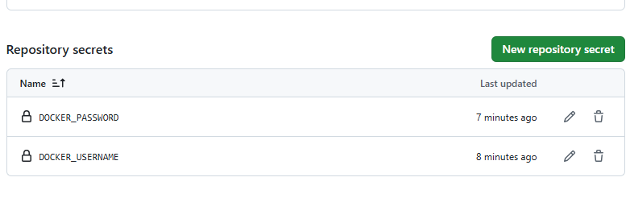
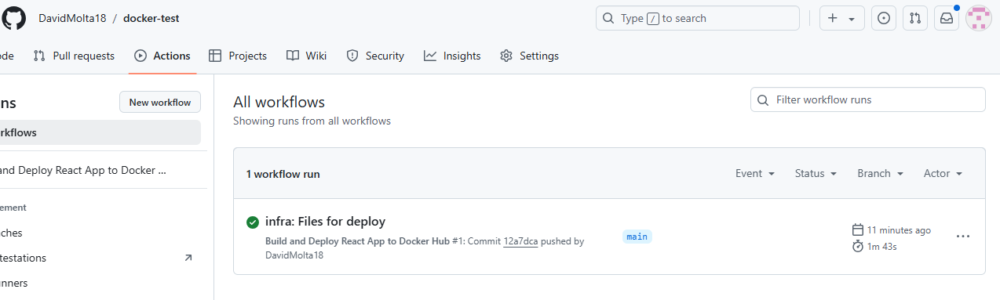
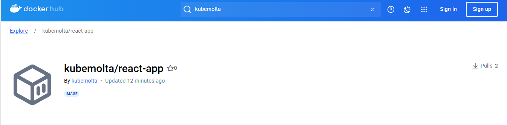
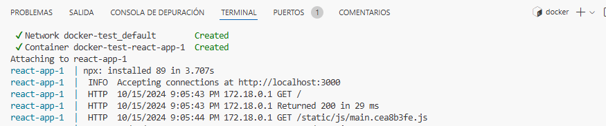
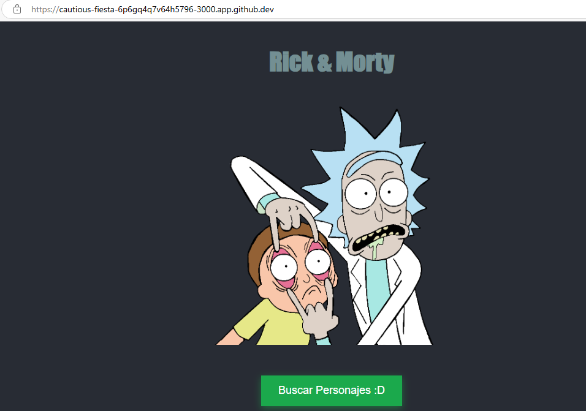
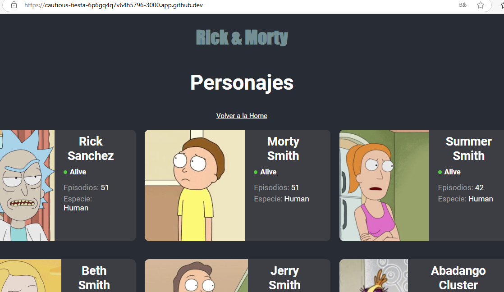

# 🚀 Despliegue Automático con Docker y GitHub Actions

Este proyecto tiene como objetivo desplegar una aplicación React utilizando Docker y GitHub Actions, integrando un flujo de CI/CD completo para facilitar el despliegue continuo.

---

## 📑 **Pasos Realizados en el Proyecto**

### 1. 🔧 **Configuración del `Dockerfile`**

Creamos un `Dockerfile` que describe cómo se debe construir la imagen de Docker para nuestra aplicación React. Aquí indicamos que la imagen debe basarse en Node.js y luego copiamos el código de la aplicación al contenedor.

```Dockerfile
# Utilizamos la imagen oficial de Node.js
FROM node:14
...
```

### 2. ⚙️ **Configuración del `docker-compose.yml`**

El archivo `docker-compose.yml` nos ayuda a orquestar el contenedor. Lo hemos configurado para exponer la aplicación en el puerto `3000`.

```yaml
version: "3.8"
services:
  web-app:
    build: .
    ports:
      - "3000:3000"
```

### 3. 🔐 **Uso de Secretos en GitHub Actions**

Para autenticarse con Docker Hub sin exponer las credenciales, utilizamos secretos en GitHub Actions. Configuramos los secretos `DOCKER_USERNAME` y `DOCKER_PASSWORD` en el repositorio.

#### 🔑 **¿Cómo configuramos los secretos?**
1. Ve al repositorio en GitHub.
2. Dirígete a **Settings** → **Secrets and variables** → **Actions**.
3. Crea dos nuevos secretos:
   - `DOCKER_USERNAME`: tu nombre de usuario de Docker Hub.
   - `DOCKER_PASSWORD`: la contraseña asociada a tu cuenta de Docker Hub.

Estos secretos se usan en el archivo de configuración de GitHub Actions para autenticarnos en Docker y subir la imagen automáticamente.



### 4. 🛠️ **Definición del Pipeline en GitHub Actions**

Configuramos GitHub Actions para automatizar la construcción y despliegue de la imagen en Docker Hub. Usamos los secretos previamente configurados para autenticar nuestra cuenta en Docker y así poder subir las imágenes sin exponer las credenciales.

```yaml
name: Build and Deploy React App to Docker Hub

on:
  push:
    branches:
      - main

jobs:
  build-app:
    runs-on: ubuntu-latest

    steps:
      # Checkout repositorio
      - name: Checkout repository
        uses: actions/checkout@v2

      # Docker Buildx
      - name: Set up Docker Buildx
        uses: docker/setup-buildx-action@v2

      # Iniciar sesión en DockerHub
      - name: Authenticate with Docker Hub
        uses: docker/login-action@v2
        with:
          username: ${{ secrets.DOCKER_USERNAME }}
          password: ${{ secrets.DOCKER_PASSWORD }}

      # Build y push de la imagen Docker a DockerHub
      - name: Push Docker Image to Docker Hub
        uses: docker/build-push-action@v4
        with:
          context: .
          push: true
          tags: ${{ secrets.DOCKER_USERNAME }}/react-app:latest
```

Luego de hacer push pudimos ver el proceso de creación del workflow, y confirmar que todo funcionaba correctamente.


Luego revisamos en dockerhub si la imagen estaba disponible.


### 5. 🌐 **Verificación del Despliegue Local**

Luego de crear la imagen y lanzarla, verificamos que la aplicación React esté correctamente desplegada en el puerto `3000`. Para levantar la aplicación, usamos:

```bash
docker-compose up
```

Y pudimos acceder a la aplicación en el navegador a través de `http://localhost:3000` 🎉.






---

## 💡 **Conclusión**

Con estos pasos, logramos configurar un flujo de trabajo automatizado para construir, empaquetar y desplegar nuestra aplicación React con Docker y GitHub Actions. 🚀 Todo el proceso está ahora automatizado, permitiendo que los cambios en el código se reflejen rápidamente en el despliegue. Además, usamos secretos para mantener nuestras credenciales seguras durante el proceso de CI/CD. 🔐
